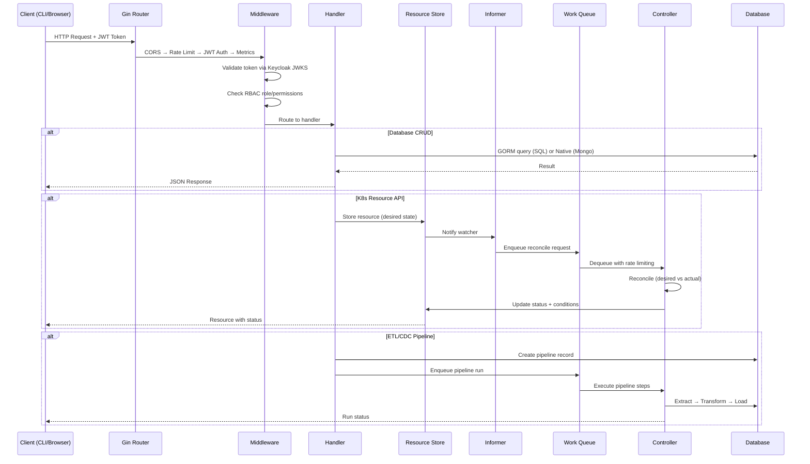
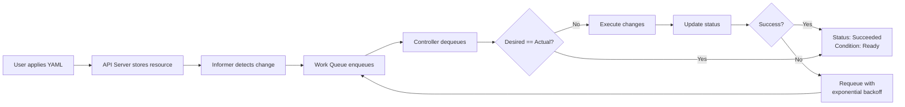
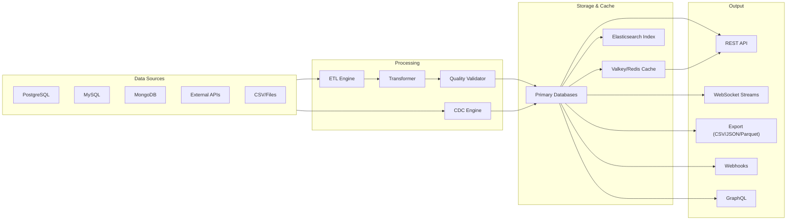
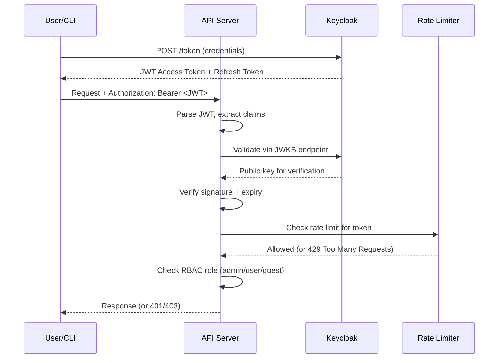

# AxiomNizam — Architecture Flowchart

## Runtime Architecture Summary

Current runtime layers (synced with README):

- Presentation layer: frontend Gin server on port 7000 with role-based dashboard routes.
- API layer: backend Gin server on port 8000 with auth, data, control-plane, and extension APIs.
- Control-plane layer: etcd-backed resource APIs and reconcile runtime loop on a dedicated runtime port (default 8001).
- Platform services layer: bulk/eventbus/export/webhook/stream/tenant/rbac/versioning/lineage/tracing managers, plus Conductor, IAM, and native object storage modules.

Runtime notes:

- Conductor routes mount at /api/v1/conductor and /ws/conductor when messaging backends initialize.
- IAM routes mount when IAM system initialization succeeds, including /iam/* and OIDC well-known endpoints.
- Storage routes mount under /api/v1/storage when object storage initialization succeeds.

## Feature Surface Summary

Primary feature areas (synced with README):

- Core API and auth: health/status/distributed, JWT/OAuth flows, token lifecycle, and token-bound rate limiting.
- Multi-database APIs: SQL CRUD and dynamic query endpoints for MySQL, MariaDB, PostgreSQL, Percona, Oracle, plus MongoDB/Firebase user handlers.
- GraphQL APIs with schema and playground.
- Control-plane APIs: namespaced resources, policy/workflow resources, workflow execution history, datasource registry, and job scheduling lifecycle.
- Platform service APIs: bulk operations, eventbus ack and DLQ replay, exports, webhooks, stream subscriptions, tenancy, RBAC access requests, versioning, lineage, and tracing.
- Conductor APIs: producer/consumer lifecycle, backend connection management, publish/stream, and DLQ replay.
- IAM APIs: OIDC metadata/JWKS, IAM auth, admin user/client/role operations, and IAM v2 realm/group/scope/session/event features.
- Native object storage APIs: bucket/object operations, presign/share, access keys, bucket policies, lifecycle, metrics, and governance controls.
- Data platform APIs: ETL and CDC pipelines, connectors/catalogs/observability, and platform overview.
- API Builder APIs: custom API CRUD/runtime invocation, CSV upload, dashboard/GIS generation, conversion workflows, file malware scan, API scan reports, and SQL assistant.
- Extension modules: kubeplus admission/scheduler/CRD, netintel mode detectors, vectorplus similarity search, and reviewflow scoring/quality pipeline.
- CLI operational tooling: discovery scans, wait checks, Trivy-based scan commands, and integration governance commands.

## API Domain Coverage (Prefix Map)

| Domain | Main Prefixes |
|---|---|
| Core auth and health | /health, /status, /distributed, /auth/*, /api/v1/auth/* |
| Data and query | /api/{mysql,mariadb,postgres,percona,oracle}/*, /api/transform/* |
| GraphQL | /api/graphql* |
| Control plane | /api/v1/namespaces/*, /api/v1/apis, /api/v1/policies, /api/v1/workflows, /api/v1/datasources*, /api/v1/jobs* |
| Platform services | /api/v1/bulk/*, /api/v1/eventbus/*, /api/v1/exports*, /api/v1/webhooks*, /api/v1/streams*, /api/v1/tenants*, /api/v1/rbac*, /api/v1/versioning*, /api/v1/lineage*, /api/v1/tracing* |
| Data platform and UI backends | /api/v1/gis*, /api/v1/analytics*, /api/v1/etl*, /api/v1/cdc*, /api/v1/data-platform/overview, /api/v1/builder*, /api/v1/netintel* |
| Conductor | /api/v1/conductor*, /ws/conductor |
| IAM and OIDC | /.well-known/*, /realms/:realm/protocol/openid-connect/*, /oauth/*, /iam/* |
| Object storage | /api/v1/storage* |
| Runtime custom APIs | /api/custom, /api/custom/*path |

## Platform Architecture

```mermaid
graph TB
    subgraph Clients["Clients"]
        CLI["axiomnizamctl\n(kubectl-style CLI)"]
        Browser["Web Browser"]
        Postman["Postman / HTTP Client"]
    end

    subgraph Frontend["Frontend — Port 7000"]
        FE_Server["Gin Server"]
        FE_Dash["Main Dashboard"]
        FE_Admin["Admin Dashboard"]
        FE_GIS["GIS Dashboard\n(Leaflet.js)"]
        FE_Analytics["Analytics Dashboard\n(Chart.js)"]
        FE_CDCETL["CDC/ETL Dashboard"]
        FE_NetIntel["NetIntel Dashboard"]
    end

    subgraph APIServer["API Server — Port 8000"]
        direction TB
        Router["Gin HTTP Router"]

        subgraph Middleware["Middleware Chain"]
            CORS["CORS"]
            RateLimit["Rate Limiter"]
            JWT_MW["JWT Auth"]
            Metrics_MW["Metrics Tracker"]
            RoleMW["RBAC Check"]
        end

        subgraph Handlers["HTTP Route Domains"]
            H_Health["Health / Status"]
            H_Auth["Auth / OAuth"]
            H_UserCRUD["User CRUD\n(SQL + NoSQL)"]
            H_DynQuery["Dynamic Query\n(5 SQL DBs)"]
            H_Resource["K8s Resource API"]
            H_GIS["GIS / Analytics"]
            H_Analytics["Dashboards"]
            H_CDCETL["CDC/ETL / Builder"]
            H_NetIntel["NetIntel"]
            H_Transform["Transform"]
            H_DS["DataSource / Job"]
            H_Job["Platform Ops"]
            H_Admin["Admin / Metrics"]
            H_Notif["Notifications"]
            H_Conductor["Conductor"]
            H_IAM["IAM / OIDC"]
            H_Storage["Object Storage"]
            H_Ext["KubePlus / Vector / ReviewFlow"]
        end

        subgraph FeatureAPIs["Platform Services and Extensions"]
            F_Tenant["Tenant"]
            F_Streaming["Streaming\n(WebSocket)"]
            F_Bulk["Bulk Ops"]
            F_Version["Versioning"]
            F_Webhook["Webhooks"]
            F_EventBus["Event Bus"]
            F_Tracing["Tracing"]
            F_Export["Export"]
            F_Lineage["Lineage"]
            F_RBAC["RBAC"]
            F_Conductor["Conductor"]
            F_IAM["IAM"]
            F_Storage["Storage"]
            F_Kubeplus["KubePlus"]
            F_Vector["VectorPlus"]
            F_Review["ReviewFlow"]
        end
    end

    subgraph ControlPlane["Kubernetes-Style Control Plane"]
        direction TB
        APIStore["API Server\n(Resource Store)"]
        Informer["Informer\n(Watch Changes)"]
        WorkQ["Work Queue\n(Priority + Rate Limit)"]
        
        subgraph Controllers["Controllers"]
            C_Workload["Workload\nReconciler"]
            C_Pipeline["Pipeline\nReconciler"]
            C_Schedule["Schedule\nReconciler"]
        end

        EventBus_Core["Event Bus\n(Pub/Sub)"]
        Runtime["Runtime\n(Controller Manager)"]
        StatusTracker["Status Tracker"]
    end

    subgraph DataIntegration["Data Integration"]
        ETL["ETL Engine\n(10 step types)"]
        CDC["CDC Engine\n(Change Capture)"]
        Workflows["Workflow Engine"]
        JobQueue["Job Queue\n(Priority, DLQ,\nCron, Fairness)"]
        GraphQL_Engine["GraphQL\n(Dynamic Schema)"]
    end

    subgraph Security["Policy and Security"]
        Keycloak["Keycloak\n(OIDC, Port 8080)"]
        IAMCore["IAM Core\n(OIDC + Admin APIs)"]
        JWT_Val["JWT Validator"]
        PolicyEngine["Policy Engine\n(CEL / Rego / DSL)"]
        RLS["Row-Level Security"]
        FieldEncrypt["Field Encryption\n(AES-256-GCM)"]
    end

    subgraph Observability["Observability"]
        AuditLog["Audit Logger\n(GDPR, HIPAA,\nSOC2, PCI-DSS)"]
        Tracing["Distributed Tracing\n(OpenTelemetry)"]
        PromMetrics["Prometheus Metrics"]
        QualityCheck["Data Quality"]
        LineageTracker["Data Lineage"]
        PerfAnalyzer["Performance\nAnalyzer"]
    end

    subgraph DataLayer["Data Layer"]
        subgraph SQL_DBs["SQL Databases"]
            PG["PostgreSQL"]
            MySQL["MySQL"]
            MariaDB["MariaDB"]
            Percona["Percona"]
            Oracle["Oracle"]
        end
        
        subgraph NoSQL_DBs["NoSQL / Other"]
            MongoDB["MongoDB"]
            Valkey["Valkey/Redis\n(Cache + Queue)"]
            ES["Elasticsearch"]
            RabbitMQ["RabbitMQ"]
            Kafka["Kafka"]
            ObjectStore["Native Object\nStorage"]
            Etcd["etcd\n(Distributed State)"]
        end
    end

    %% Client connections
    CLI -->|"HTTP + JWT"| Router
    Browser -->|HTTP| FE_Server
    Postman -->|"HTTP + JWT"| Router

    %% Frontend to backend
    FE_Server --> FE_Dash & FE_Admin & FE_GIS & FE_Analytics & FE_CDCETL & FE_NetIntel
    FE_Server -->|"Proxy to :8000"| Router

    %% Router through middleware to handlers
    Router --> Middleware
    Middleware --> Handlers
    Middleware --> FeatureAPIs

    %% Handlers to control plane
    H_Resource -->|"Create/Update"| APIStore
    APIStore -->|"Notify"| Informer
    Informer -->|"Enqueue"| WorkQ
    WorkQ --> Controllers
    Controllers -->|"Update"| StatusTracker
    Controllers -->|"Publish"| EventBus_Core
    Runtime -->|"Manages"| Controllers

    %% Handlers to data integration
    H_CDCETL --> ETL & CDC
    H_Job --> JobQueue
    H_DynQuery --> SQL_DBs

    %% Security
    JWT_MW --> JWT_Val
    JWT_Val --> Keycloak
    H_IAM --> IAMCore
    IAMCore --> Keycloak
    RoleMW --> PolicyEngine
    H_Auth --> Keycloak
    FieldEncrypt --> SQL_DBs

    %% Data connections
    H_UserCRUD --> SQL_DBs & MongoDB
    H_Analytics --> Valkey
    H_Conductor --> RabbitMQ & Kafka
    H_Storage --> ObjectStore
    Handlers --> SQL_DBs & NoSQL_DBs
    FeatureAPIs --> SQL_DBs & NoSQL_DBs
    JobQueue --> Valkey
    ETL --> SQL_DBs
    CDC --> SQL_DBs

    %% Observability connections
    Handlers -.->|"Log"| AuditLog
    Controllers -.->|"Trace"| Tracing
    Handlers -.->|"Metrics"| PromMetrics

    %% Distributed
    Runtime -->|"Leader Election"| Etcd
```

## Request Flow

## Control Plane Reconciliation Loop

## Data Flow Architecture

## Authentication Flow

