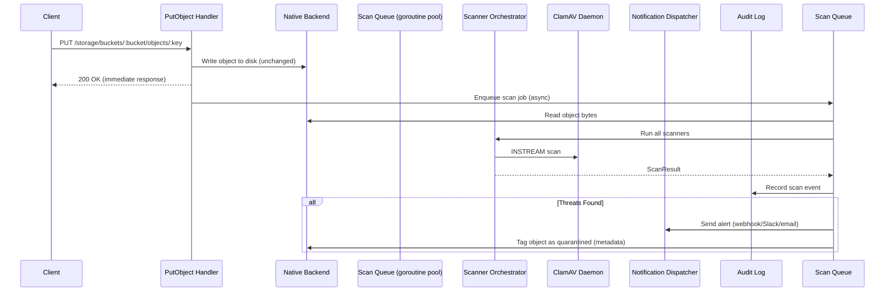

# 🛡️ Object Storage File Scanner — Implementation Plan

## Overview

Integrate the existing `internal/scanner` (file scanner) and ClamAV (malware scanner) into the object storage upload pipeline so that **every object uploaded to any bucket is automatically scanned** — without blocking or slowing the upload itself.

---

## Architecture



> [!IMPORTANT]
> The upload is **never delayed**. The scan runs asynchronously after the object is persisted. The client gets `200 OK` immediately, and scan results are delivered via notifications and metadata tagging.

---

## Implementation Steps

### Phase 1: Scan Service Layer (`internal/scanner/service.go`)

Create a new `ScanService` that manages the async scan pipeline:

| Component | Purpose |
|-----------|---------|
| `ScanJob` struct | Holds bucket, key, tenant, user info for a pending scan |
| `ScanService` struct | Manages worker pool, scan queue, orchestrator reference |
| `ScanService.Enqueue()` | Non-blocking enqueue of a scan job |
| `ScanService.worker()` | Goroutine that dequeues jobs, reads object, runs orchestrator |
| Configurable worker count | `SCANNER_WORKERS` env var (default: 4) |
| Configurable queue size | `SCANNER_QUEUE_SIZE` env var (default: 10000) |

**Key design decisions:**
- Buffered channel as the queue — if full, log a warning but **don't block** the upload
- Workers read the object from the backend, build `FileInfo`, pass to `Orchestrator.Scan()`
- After scan, update object metadata with scan results (`x-axiom-scan-status`, `x-axiom-scan-at`)
- If unsafe: tag metadata as `quarantined`, record audit event, fire notification

---

### Phase 2: Scan Event Types & Notification (`internal/scanner/notification.go`)

Add scan-specific event types and a notification dispatcher:

| Item | Details |
|------|---------|
| `EventObjectScanned` | New event type: `"object.scanned"` |
| `EventObjectQuarantined` | New event type: `"object.quarantined"` |
| `ScanNotifier` | Interface for sending scan result notifications |
| Webhook notifier | Uses existing `alerting.ChannelDispatcher` for multi-channel alerts |
| `SCANNER_WEBHOOK_URL` | Env var for a dedicated scan webhook (simple option) |
| `SCANNER_NOTIFICATION_CHANNELS` | Comma-separated alerting channel names (advanced option) |

**Notification payload:**
```json
{
  "event": "object.quarantined",
  "bucket": "my-bucket",
  "key": "uploads/malware.exe",
  "tenant": "tenant-123",
  "uploadedBy": "user-456",
  "scanResult": {
    "safe": false,
    "findings": [
      {"scanner": "clamav_antivirus", "severity": "critical", "description": "Malware detected", "details": "Win.Trojan.Generic-123"}
    ],
    "scannedAt": "2026-05-12T20:30:00Z",
    "durationMs": 245
  }
}
```

---

### Phase 3: Wire Into Storage System (`internal/storage/storage.go`)

Modify `storage.System` to hold and initialize the `ScanService`:

| Change | File | Details |
|--------|------|---------|
| Add `Scanner *scanner.ScanService` field | `storage.go` | New field on `System` struct |
| Initialize in `NewSystem()` | `storage.go` | Create orchestrator + scan service |
| Start workers in `Start()` | `storage.go` | `s.Scanner.Start(ctx)` |
| Stop workers in `Stop()` | `storage.go` | `s.Scanner.Stop()` |
| `SCANNER_ENABLED` env var | `storage.go` | Feature flag (default: `true`) |
| `SCANNER_CLAMAV_ADDRESS` env var | `storage.go` | ClamAV TCP address (default: `clamav:3310`) |

---

### Phase 4: Hook Into PutObject Handler (`internal/storage/admin/admin.go`)

Modify `PutObject()` to enqueue a scan job after successful write:

```diff
 // After successful PutObjectWithOptions and audit.Record:
+
+// Enqueue async security scan (non-blocking).
+if h.scanner != nil {
+    h.scanner.Enqueue(scanner.ScanJob{
+        Bucket:   backendBucket,
+        Key:      key,
+        TenantID: tenantID,
+        UserID:   userID,
+        SourceIP: c.ClientIP(),
+    })
+}
```

> [!TIP]
> The `Enqueue` call is a non-blocking channel send. If the queue is full, the job is dropped with a warning log — the upload is **never** delayed.

---

### Phase 5: Scan Status API (`internal/storage/admin/admin.go`)

Add endpoints for querying scan results:

| Endpoint | Method | Description |
|----------|--------|-------------|
| `GET /storage/buckets/:bucket/scan-status?key=...` | GET | Get scan result for a specific object |
| `GET /storage/buckets/:bucket/quarantined` | GET | List all quarantined objects in a bucket |
| `POST /storage/scan` | POST | Manually trigger a scan for an object |

---

### Phase 6: Docker / Infrastructure

| Change | File | Details |
|--------|------|---------|
| Add ClamAV service | `docker-compose.yml` | `clamav/clamav:latest` on port 3310 |
| Add env vars | `.env.example` | Scanner config variables |
| Health check | ClamAV container | `clamdcheck` or TCP probe |

```yaml
clamav:
  image: clamav/clamav:latest
  container_name: axiom-clamav
  ports:
    - "3310:3310"
  volumes:
    - clamav-data:/var/lib/clamav
  restart: unless-stopped
  healthcheck:
    test: ["CMD", "clamdcheck"]
    interval: 60s
    timeout: 10s
    retries: 3
```

---

## File Manifest

| File | Action | Description |
|------|--------|-------------|
| `internal/scanner/service.go` | **CREATE** | Async scan service with worker pool |
| `internal/scanner/notification.go` | **CREATE** | Scan notification dispatcher |
| `internal/storage/storage.go` | **MODIFY** | Add ScanService to System, wire init/start/stop |
| `internal/storage/admin/admin.go` | **MODIFY** | Add scanner field to Handler, enqueue in PutObject, add scan API routes |
| `internal/storage/events/events.go` | **MODIFY** | Add scan event type constants |
| `docker-compose.yml` | **MODIFY** | Add ClamAV service |
| `.env.example` | **MODIFY** | Add scanner env vars |

---

## Environment Variables

| Variable | Default | Description |
|----------|---------|-------------|
| `SCANNER_ENABLED` | `true` | Enable/disable file scanning |
| `SCANNER_WORKERS` | `4` | Number of concurrent scan workers |
| `SCANNER_QUEUE_SIZE` | `10000` | Max pending scan jobs |
| `SCANNER_CLAMAV_ADDRESS` | `clamav:3310` | ClamAV daemon TCP address |
| `SCANNER_CLAMAV_ENABLED` | `true` | Enable ClamAV antivirus scanner |
| `SCANNER_MAX_FILE_SIZE` | `104857600` | Max file size to scan (100MB) |
| `SCANNER_WEBHOOK_URL` | _(empty)_ | Webhook URL for scan notifications |
| `SCANNER_QUARANTINE_UNSAFE` | `true` | Auto-quarantine unsafe objects via metadata |

---

## Execution Order

1. ✅ **Phase 1** — `scanner/service.go` (async pipeline core)
2. ✅ **Phase 2** — `scanner/notification.go` (alert dispatch)
3. ✅ **Phase 3** — `storage.go` wiring
4. ✅ **Phase 4** — `admin.go` PutObject hook + scanner field
5. ✅ **Phase 5** — Scan status API routes
6. ✅ **Phase 6** — Docker + env config

> [!NOTE]
> Each phase is independently testable. Phase 1-2 can be unit-tested without any storage dependency. Phase 3-4 is the integration point. Phase 5-6 adds observability and infrastructure.
