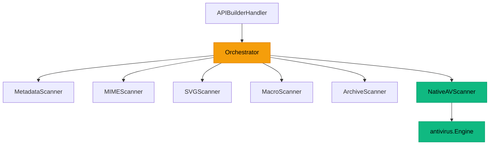

# 🔬 SafeGate Scanner Module — Analysis & Restructuring Plan

## 1. Current State Audit

### Module Inventory

| File | Lines | Size | Purpose |
|------|-------|------|---------|
| `scanner.go` | 118 | 3.1 KB | Core types (Finding, ScanResult, FileInfo), Scanner interface, Orchestrator |
| `metadata.go` | 91 | 2.4 KB | File size, empty files, null bytes, suspicious filenames |
| `mime.go` | 129 | 4.5 KB | MIME type validation, file type spoofing, executable magic bytes |
| `svg.go` | 76 | 2.6 KB | SVG XSS: script tags, event handlers, JS URIs, foreignObject |
| `macro.go` | 173 | 5.4 KB | Office macro detection (VBA, auto-exec), PDF malicious content |
| `archive.go` | 151 | 4.4 KB | Zip bomb detection, path traversal, executable detection in archives |
| `native_av.go` | 65 | 1.8 KB | Bridge: wraps antivirus.Engine as scanner.Scanner interface |
| **Total** | **803** | **24.2 KB** | — |

### Architecture Diagram



### Integration Points

| Caller | File | Usage |
|--------|------|-------|
| CSV Upload (UploadCSV) | `api_builder_handler.go:1828` | Pre-upload file validation — blocks upload if unsafe |
| Manual Scan (ScanFile) | `api_builder_handler.go:2552` | On-demand file scan API with result persistence |
| Scanner Health | `api_builder_handler.go:2613` | Returns registered scanner names and total scan count |
| Storage Upload | `internal/storage/` | Async post-upload scan via antivirus.Engine (separate path) |

---

## 2. Problems Identified

### 🔴 Critical Issues

| # | Problem | Impact |
|---|---------|--------|
| C-1 | **Zero tests** — No `*_test.go` files in the entire module | Cannot verify correctness. Every scanner is untested. Regressions will be invisible. |
| C-2 | **Everything in one flat package** — 7 files, no subpackages | Types, orchestrator, and 6 scanners all share one namespace. No separation of concerns. |
| C-3 | **No configuration** — All thresholds are hardcoded at call site | `maxFileSize`, allowed MIME types, max nesting depth, max decompression size are all passed from `api_builder_handler.go`. No env vars, no config struct. |

### 🟡 Design Issues

| # | Problem | Impact |
|---|---------|--------|
| D-1 | **Orchestrator runs scanners sequentially** | Slow on large files when many scanners are registered. No parallelism. |
| D-2 | **No scanner-level timeouts** | A stuck scanner blocks the entire pipeline. No context.Context support. |
| D-3 | **Scanner interface lacks context** | `Scan(file *FileInfo) ([]Finding, error)` has no ctx, no cancellation, no deadline propagation. |
| D-4 | **No scan metrics/observability** | No per-scanner timing, no counters, no health status. `GetScannerHealth` only returns names. |
| D-5 | **Metadata scanner iterates all bytes for null check** | O(n) full-content scan for null bytes in text files. Inefficient for large files. |
| D-6 | **MIME compat map is hard to maintain** | Inline `map[string][]string` literal. Not extensible or configurable. |
| D-7 | **Archive scanner only handles ZIP** | `isArchive()` matches .rar, .7z, .tar, .gz, .bz2 but `analyzeZip()` only works with ZIP format. Other formats silently pass through. |
| D-8 | **Macro scanner casts entire binary to string** | `string(data)` on binary OLE/PDF files is fragile and wastes memory. |

### 🟢 Good Design Patterns (Keep)

| Pattern | Where | Notes |
|---------|-------|-------|
| `Scanner` interface | `scanner.go:52-55` | Clean, minimal interface. Good for extensibility. |
| Orchestrator pattern | `scanner.go:57-108` | Simple and effective for sequential pipeline. |
| Compiled regex patterns | `svg.go`, `macro.go` | `var` block with `regexp.MustCompile` — avoids recompilation. |
| Magic byte detection | `mime.go:111-128` | Correct PE/ELF/Mach-O header checks. |
| Zip bomb detection | `archive.go:67-76` | Proper compression ratio analysis with configurable threshold. |

---

## 3. Comparison: Scanner vs Antivirus Module

| Dimension | Scanner (SafeGate) | Antivirus Engine |
|-----------|-------------------|------------------|
| **Files** | 7 (803 lines) | 30 (347K bytes) |
| **Test files** | 0 ❌ | 7 ✅ |
| **Config** | None (hardcoded) | `config.go` with env vars |
| **Subpackages** | None (flat) | 6 (cache, entropy, hashdb, heuristic, matcher, sigdb, yara) |
| **Context support** | None | Full `context.Context` propagation |
| **Observability** | None | Scan stats, threat log, status API |
| **Concurrency** | Sequential only | Worker pool with configurable count |
| **Types** | Inline in scanner.go | Dedicated `types.go` (16KB) |

---

## 4. Proposed Architecture

### Target Structure

```
internal/scanner/
├── scanner.go            # Scanner interface + severity constants (KEEP)
├── types.go              # FileInfo, Finding, ScanResult types (EXTRACT from scanner.go)
├── orchestrator.go       # Orchestrator with parallel execution + context + metrics (REWRITE)
├── config.go             # Config struct + env var loading (NEW)
├── metadata/
│   ├── metadata.go       # MetadataScanner (MOVE + ENHANCE)
│   └── metadata_test.go  # Tests (NEW)
├── mime/
│   ├── mime.go           # MIMEScanner (MOVE + ENHANCE)
│   ├── compat.go         # MIME compatibility map (EXTRACT)
│   └── mime_test.go      # Tests (NEW)
├── svg/
│   ├── svg.go            # SVGScanner (MOVE)
│   └── svg_test.go       # Tests (NEW)
├── macro/
│   ├── macro.go          # MacroScanner — office + PDF analysis (MOVE)
│   └── macro_test.go     # Tests (NEW)
├── archive/
│   ├── archive.go        # ArchiveScanner — ZIP + TAR + GZIP (MOVE + ENHANCE)
│   └── archive_test.go   # Tests (NEW)
├── native/
│   ├── native_av.go      # NativeAVScanner bridge (MOVE)
│   └── native_av_test.go # Tests (NEW)
└── orchestrator_test.go  # Orchestrator integration tests (NEW)
```

### Key Architectural Changes

#### Phase 1: Foundation — Types, Config & Tests (Groundwork)
Extract shared types into `types.go`, create `config.go` with env var support, keep everything backward compatible.

- **types.go**: Move `Severity`, `Finding`, `ScanResult`, `FileInfo` out of `scanner.go`
- **config.go**: Centralized config struct with env vars:
  ```
  SCANNER_MAX_FILE_SIZE          (default: 104857600 = 100MB)
  SCANNER_ALLOWED_MIME_TYPES     (default: comma-separated list)
  SCANNER_ARCHIVE_MAX_DEPTH      (default: 5)
  SCANNER_ARCHIVE_MAX_DECOMPRESS (default: 1073741824 = 1GB)
  SCANNER_ARCHIVE_MAX_FILES      (default: 10000)
  SCANNER_PARALLEL               (default: true)
  SCANNER_TIMEOUT                (default: 2m)
  SCANNER_NULL_BYTE_SAMPLE_SIZE  (default: 8192)
  ```

#### Phase 2: Orchestrator Rewrite
Rewrite the orchestrator with:
- `context.Context` propagation to all scanners
- Parallel scanner execution (configurable)
- Per-scanner timeout and metrics
- Scanner-level error isolation

Updated interface:
```go
type Scanner interface {
    Name() string
    Scan(ctx context.Context, file *FileInfo) ([]Finding, error)
}
```

#### Phase 3: Subpackage Extraction
Move each scanner into its own subpackage for:
- Independent testability
- Cleaner dependency graph
- Each scanner can own its own config/constants

#### Phase 4: Individual Scanner Enhancements

| Scanner | Enhancement |
|---------|-------------|
| **Metadata** | Sample-based null byte detection (first 8KB instead of full file). Unicode/control char detection. Path traversal in filenames. |
| **MIME** | Configurable compat map. More magic byte signatures (WebAssembly, Java class). |
| **SVG** | CSS `@import` and `url()` detection. `<use>` element external reference detection. |
| **Macro** | OLE2 stream-based analysis instead of string search. DDE link detection. Active-X detection. |
| **Archive** | TAR/GZIP/BZ2 analysis (currently only ZIP). Symlink bomb detection. |

#### Phase 5: Observability & Metrics
- Per-scanner execution time tracking
- Scan throughput counters
- Finding severity distribution
- Export as Prometheus metrics or via health endpoint

#### Phase 6: Integration Tests & Documentation
- Comprehensive test suite with real file samples
- Benchmark tests for performance regression detection
- Update `docs/` with scanner architecture documentation

---

## 5. Execution Order

| Phase | Scope | Effort | Risk |
|-------|-------|--------|------|
| **Phase 1** | Types + Config + No Breaking Changes | Small | Low — additive only |
| **Phase 2** | Orchestrator rewrite with context + parallel | Medium | Medium — interface change affects all scanners |
| **Phase 3** | Subpackage extraction | Medium | Low — pure structural refactor |
| **Phase 4** | Individual scanner improvements | Large | Low — each scanner is independent |
| **Phase 5** | Observability | Small | Low — additive |
| **Phase 6** | Tests + Docs | Medium | None |

> [!IMPORTANT]
> **Phase 2 is the critical interface change.** The `Scanner` interface gains `context.Context`, which requires updating all 6 scanner implementations + the `native_av.go` bridge. This should be done in one atomic commit to avoid partial breakage.

---

## 6. File Impact Summary

| Current File | Action | Target |
|-------------|--------|--------|
| `scanner.go` | **SPLIT** → keep interface + severity constants; move types to `types.go`, move orchestrator to `orchestrator.go` |
| `metadata.go` | **MOVE** → `metadata/metadata.go` + add tests |
| `mime.go` | **MOVE** → `mime/mime.go` + extract compat map to `mime/compat.go` + add tests |
| `svg.go` | **MOVE** → `svg/svg.go` + add tests |
| `macro.go` | **MOVE** → `macro/macro.go` + add tests |
| `archive.go` | **MOVE** → `archive/archive.go` + add tests |
| `native_av.go` | **MOVE** → `native/native_av.go` + add tests |
| `config.go` | **NEW** — centralized configuration |
| `types.go` | **NEW** — extracted shared types |
| `orchestrator.go` | **NEW** — rewritten orchestrator with ctx + parallel + metrics |

---

## 7. Backward Compatibility Strategy

To avoid breaking `api_builder_handler.go` and `storage/` during migration:

1. **Phase 1–2**: Keep everything in the `scanner` package. Types stay accessible as `scanner.FileInfo`, `scanner.Finding`, etc.
2. **Phase 3**: When extracting to subpackages, the root `scanner` package will re-export types via type aliases:
   ```go
   // scanner/scanner.go — backward compat aliases
   type FileInfo = types.FileInfo
   type Finding = types.Finding
   ```
3. **Phase 2 interface change**: Update all scanners atomically. The `api_builder_handler.go` calls `h.scanOrch.Scan(info)` which doesn't change — only the internal scanner implementations gain `ctx`.

This ensures zero breaking changes for callers at every phase boundary.
